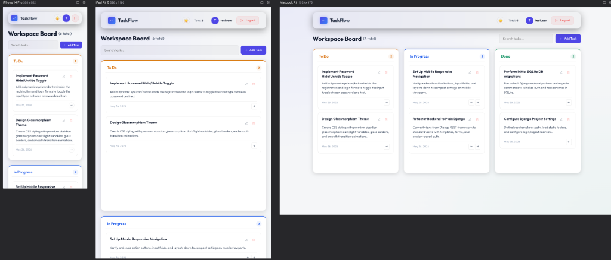
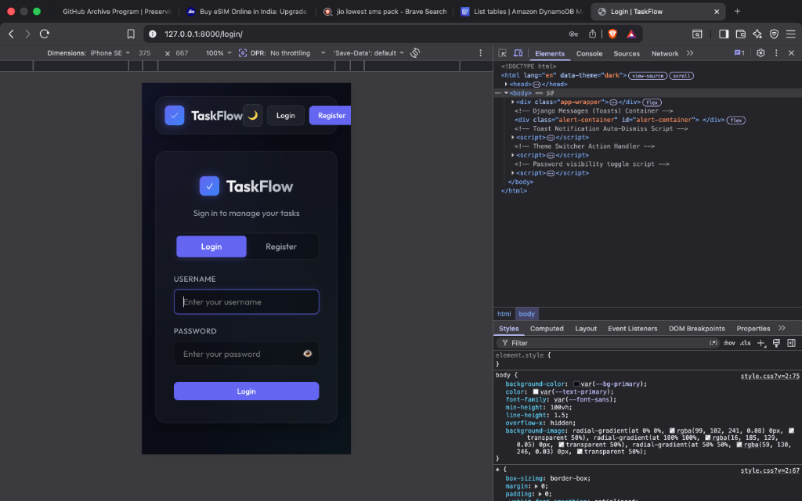
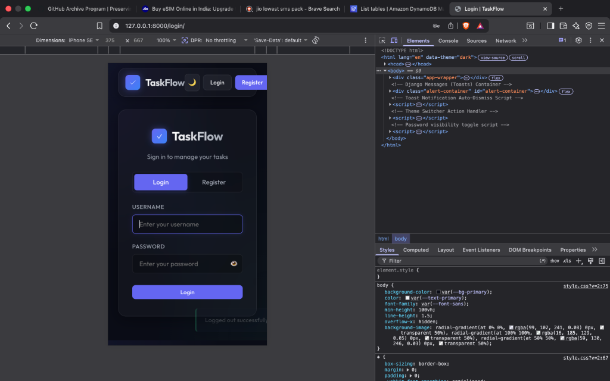
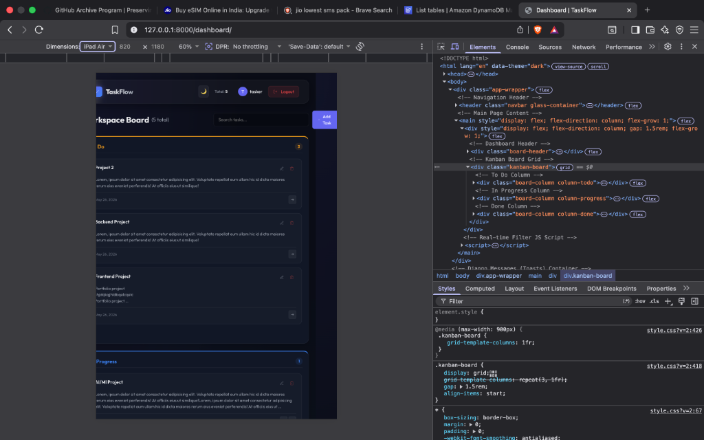
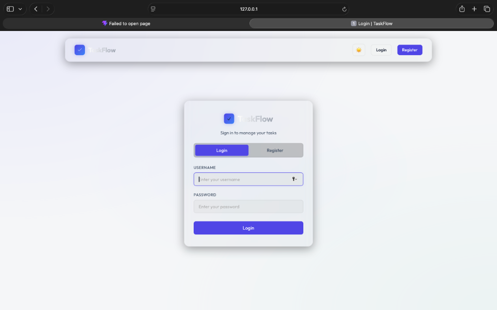
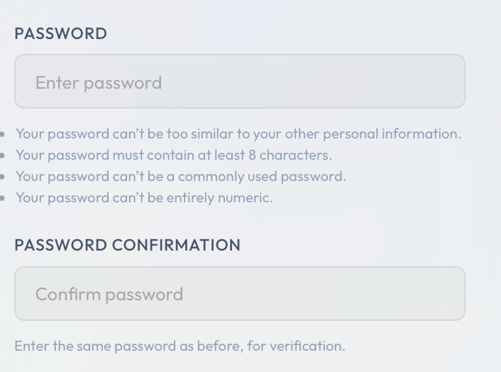
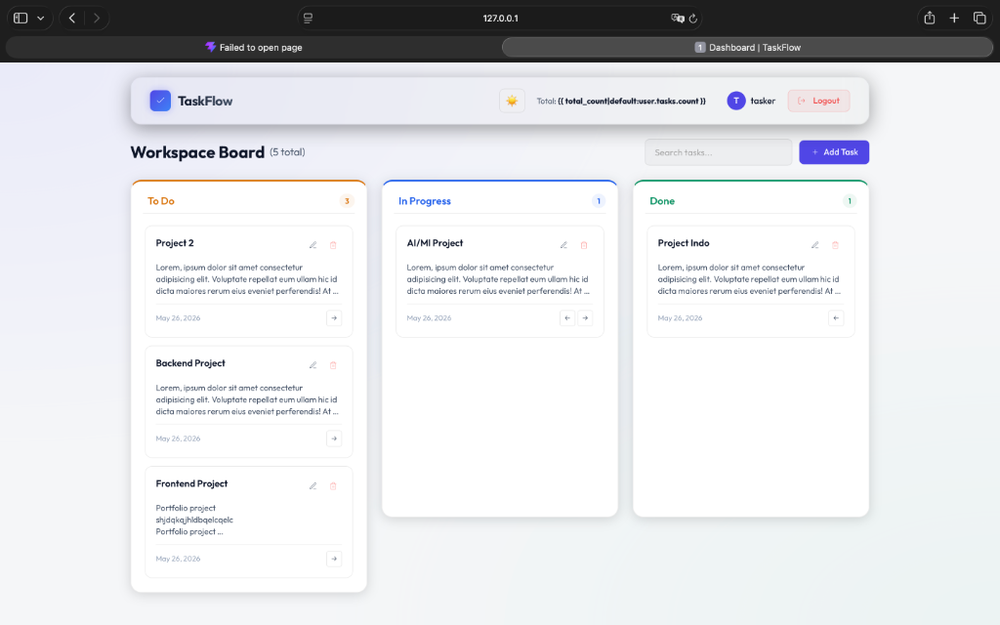

# TaskFlow - Plain Django Task Manager App

TaskFlow is a premium, plain Django task manager application built with standard templates, forms, and session-based authentication. The frontend is styled using vanilla CSS featuring an **Obsidian Glassmorphism Theme** with smooth transition animations, mobile responsiveness, and interactive elements.

---

## 🚀 Features

- **Kanban Board**: Drag-free visual progression board categorized into *To Do*, *In Progress*, and *Done* stages.
- **Glassmorphism Theme**: Obsidian dark mode with an integrated toggle to switch to a styled light mode.
- **Dynamic Search**: Instant client-side search filtering tasks by title/description in real-time, complete with live column task counts.
- **Secure Authentication**: Built-in Django session authentication with custom login and registration templates.
- **Interactive Password Toggle**: A fun password visibility utility that changes from `🙈` (monkey covering eyes) when the password is hidden to `🙉` (monkey with open eyes) when the password is plain text.
- **Device Responsive**: Symmetrical layouts tailored for desktop, tablet, and mobile screens.

---

## 🛠️ Tech Stack

- **Backend Framework**: Django 6.0+
- **Database**: SQLite3
- **Frontend**: Vanilla HTML5, CSS3, JavaScript (no REST framework, no React)
- **Deployment & Hosting**: Ready for Render deployment with Gunicorn and WhiteNoise static serving.

---

## 💻 Local Setup and Running

Follow these instructions to run the project locally on your machine:

### 1. Prerequisites
Ensure you have Python 3.10+ installed on your system.

### 2. Navigate to Backend Directory
```bash
cd backend
```

### 3. Set Up Virtual Environment & Activate
Create a virtual environment and activate it:
```bash
# On macOS / Linux
python -m venv venv
source venv/bin/activate

# On Windows
python -m venv venv
venv\Scripts\activate
```

### 4. Install Dependencies
Install all required modules from `requirements.txt`:
```bash
pip install -r requirements.txt
```

### 5. Run Database Migrations
Initialize the SQLite database schema:
```bash
python manage.py migrate
```

### 6. (Optional) Seed Mock Tasks
To quickly test the application with pre-seeded tasks and an active user profile, run the Django shell to set up a test user:
```bash
python manage.py shell -c "
from django.contrib.auth.models import User
from tasks.models import Task

user, created = User.objects.get_or_create(username='testuser')
if created or not user.check_password('Password123'):
    user.set_password('Password123')
    user.save()

Task.objects.filter(user=user).delete()
tasks = [
    {'title': 'Design Glassmorphism Theme', 'description': 'CSS styling with obsidian glassmorphism dark/light variables.', 'stage': 'todo'},
    {'title': 'Implement Password Toggle', 'description': 'Add 🙈/🙉 monkey icon toggle inside forms.', 'stage': 'todo'},
    {'title': 'Refactor Backend to Plain Django', 'description': 'Convert views from DRF to templates and forms.', 'stage': 'in_progress'},
    {'title': 'Configure Django Project Settings', 'description': 'Configure template paths, static folders, and auth redirects.', 'stage': 'done'}
]
for t in tasks:
    Task.objects.create(user=user, title=t['title'], description=t['description'], stage=t['stage'])
print('Pre-seeded account ready! Username: testuser | Password: Password123')
"
```

### 7. Run the Local Development Server
Start the Django local development server:
```bash
python manage.py runserver
```
Visit [http://127.0.0.1:8000/](http://127.0.0.1:8000/) in your web browser.

### 8. Run Automated Tests
Execute the automated test suite verifying auth redirects, task CRUD, and security bounds:
```bash
python manage.py test
```

---

## ☁️ Deployment on Render

This project is configured with a Blueprints specification (`render.yaml`), Gunicorn, and WhiteNoise, making it ready for deployment on **Render**.

### 1. Deployment Steps via Blueprint (Recommended)
1. Push your repository to GitHub or GitLab.
2. Sign in to your dashboard on [Render](https://render.com/).
3. Click **New** -> **Blueprint**.
4. Connect your repository. Render will automatically parse the `render.yaml` file in the root directory and configure the Web Service.
5. Click **Apply**.

### 2. Manual Deployment Steps
If you prefer not to use Blueprints, configure a new **Web Service** on Render with the following settings:
- **Runtime**: `Python`
- **Root Directory**: `backend`
- **Build Command**: `./build.sh`
- **Start Command**: `gunicorn task_manager.wsgi:application`

### 3. Environment Variables
Ensure the following variables are configured under the **Environment** tab:
- `PYTHON_VERSION`: `3.14.5` (or your preferred Python version)
- `SECRET_KEY`: A unique random secret key for session security.
- `DEBUG`: `False` (forces production mode settings)
- `ALLOWED_HOSTS`: `*` (or your specific Render domain, e.g. `your-app.onrender.com`)

### ⚠️ SQLite Persistence Warning
By default, Render's disk filesystem is ephemeral. If your container restarts or redeploys, any SQLite database changes will be lost.
To persist your SQLite database:
1. In your Render Web Service settings, go to the **Disks** section.
2. Click **Add Disk** and configure:
   - **Name**: `taskflow-db-disk`
   - **Mount Path**: `/data`
   - **Size**: `1 GB` (minimum)
3. Add an environment variable to override your database path (or update `settings.py` to point to `/data/db.sqlite3`):
   ```python
   # Inside settings.py
   DATABASES = {
       'default': {
           'ENGINE': 'django.db.backends.sqlite3',
           'NAME': '/data/db.sqlite3' if not DEBUG else BASE_DIR / 'db.sqlite3',
       }
   }
   ```
4. Alternatively, you can easily provision a **PostgreSQL** database service on Render and link it to Django using `dj-database-url`.

---

## 📷 Screenshots

### 📱 Responsive Layout (Side-by-Side)


### 🌑 Dark Mode
#### 1. Login Page


#### 2. Register Page


#### 3. Dashboard


### ☀️ Light Mode
#### 1. Login Page


#### 2. Register Page


#### 3. Dashboard


